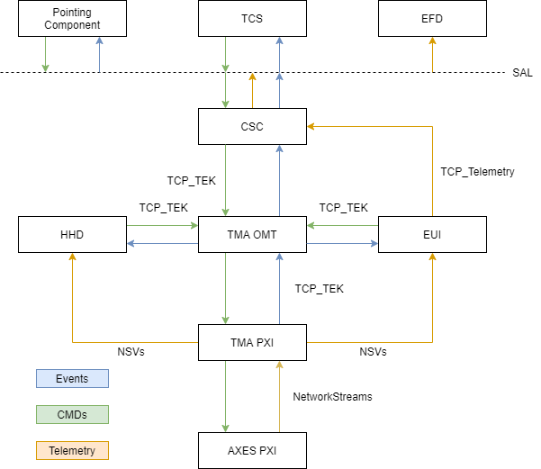

| **3151 LSST**               |                     |
|-----------------------------|---------------------|
| **Requested by:**           | **LSST**            |
| **Doc. Code / Version nº:** | Doc. Code / Version |
| **Editor:**                 | Julen Garcia        |
| **Approved by:**            |                     |
| **Date:**                   | 01/09/2019          |

\| INDEX \|

[1. Introduction 4](#introduction)

[2. Reference documents 5](#reference-documents)

[3. HMI Structure 6](#hmi-structure)

\| DOCUMENT HISTORY \|

| **Version** | **Date** | **Author** | **Comments** |
|-------------|----------|------------|--------------|
|             |          |            |              |
|             |          |            |              |
|             |          |            |              |
|             |          |            |              |
|             |          |            |              |

Introduction
============

This document explains the structure for the Human Machine Interface (HMI)
software located in the HMIComputers repository,
[here](https://gitlab.tekniker.es/aut/projects/3151-LSST/LabVIEWCode/HMIComputers).
The purpose of this documentation is to explain the architecture design of the
HMI system. To do so, the main components of the HMI code are explained. The
develop tools and tips are also included as part of the documentation and
explained in a separated file.

Important notes:

-  In the documentation there could be some misunderstandings due to the naming
    of the hardware devices and software. Mainly when using the abbreviations
    EUI and HHD.

    -   EUI stands for Engineering User Interface, but sometimes it is used to
        refer to the PC that runs the EUI itself. This PC it is named MCC (Main
        Control Computer).

    -   HHD stands for Handheld Device, but the EUI that runs on the HHD it is
        also called HHD.

-   HMI stands for Human Machine Interface, but sometimes it is referred as EUI.

Reference documents
===================

| **Nº** | **Document** | **Code** | **Version** |
|--------|--------------|----------|-------------|
| **1**  |              |          |             |
| **2**  |              |          |             |
| **3**  |              |          |             |
| **4**  |              |          |             |
| **5**  |              |          |             |

HMI Structure
=============

The Human Machine Interface (HMI) is an important part of the overall system, as
seen in Figure \ref{figureone350f30df820b4ef01f38b7cadcba9985} where the HMI code corresponds to the EUI (Engineering User
Interface) and the HHD (Handheld Device) labels. It contains important code that
makes the system work properly, as well as allowing advanced users to adjust the
system or execute maintenance operations.

Focusing only in the HMI part the Figure \ref{figureone350f30df820b4ef01f38b7cadcba9985} simplifies to the Figure \ref{figuretwo3d62584b986c8ac035e591e474694ccc}, having
the components of the HMI divided and the relation between the different
elements explained. Al the components inside the HMI Components box are coded in
LabVIEW and compiled together as the EUI, for both the HHD and the MCC, with
some variations as the screen size is different for each case.

As shown in Figure \ref{figuretwo3d62584b986c8ac035e591e474694ccc}, the components of the HMI are:

-   TCP Client: this component is the one that connects to the TMA over TCP to
    send and receive the TCP messages. The message to send is specified to the
    task by a public method of the TCP client object, and the received messages
    are published in a user event created when the object is initialized.

-   TMA Commanding: this component is the one sending commands to the TMA and
    monitoring the events received from it. This is done using the TCP Client
    component.

-   Alarm Management: this component gets the alarm and warning events from the
    TCP client, logging the received alarms and warnings to have a record of the
    different events occurred while operating the system.

-   User Management: as there are some actions that can be performed from the
    HMI (EUI or HHD) that can be dangerous for both the machine and the people
    around the system, a user based control is used to avoid certain operations
    to low level users.

-   Telemetry Management: the telemetry generated by the PXIs must be stored
    locally, the files are stored in the EUI, and sent to the CSC.

-   User Interface: the one that the user sees and interacts with.

Each of the components is explained in detail in the following files:

1.  LSST_HMI_SoftwareDocumentation_1_CommandsAndEventsManagement file. This file
    contains the Commands and Events management documentation file. This
    document contains the following components: TCP Client, TMA Commanding and
    Alarm Management.

2.  User Management documentation file. This document contains only the User
    Management component.

3.  Telemetry Management documentation file. This document contains only the
    Telemetry Management component.

4.  User Interface documentation file. This document contains only the User
    Interface component. This document contains more than one document, to make
    searching easier and faster. There is a main document with the general
    documentation of the user interface and then one document for each window.
