# TCP Client

This component is the one that connects to the TMA over TCP to send and receive
the TCP messages. The message to send is specified to the task by a public
method of the TCP client object, and the received messages are published in a
user event created when the object is initialized. These events are then
registered by another task to filter then and generate the proper user events
within the application.

For this component, the Sender.lvclass is used. This class is explained in
section 3.2 in a generic way, as this task can be used in many different ways
depending on the configuration set to it.

## Component Configuration

As explained in section 3.2.1 the Sender.lvclass requires a *\*.xml* file to
specify the configuration of the task. For this specific case, the used
configuration is specified in the “*HMIConfig.xml*” file located at the
Configuration folder inside the HMIComputers repo. In this file there is a
section called “*TMAConnectionData*” that is the one used for this component, by
specifying this name to the Sender_Init.

The values of this configuration can be modified to improve the performance or
if the IP or port of the machine running the TMA OMT (operation_manager)
changes. The values that must be maintained are:

-   ReadResponses: this must be set to FALSE.

-   ReadDataFromTCP: this must be set to TRUE.

## Sender.lvclass

This class when initialized launches a task that contains a TCP client. The
class main elements are explained in the following sections.

### Configuration file explained

This task requires from a configuration file for initialization, in*\*.xml*
format that contains the following sections:

-   Remote_Adress: the IP of the target you want to connect to.

-   Remote_Port: the port of the target you want to connect to.

-   Connect_Timeout_in_ms: timeout for the connect.

-   Send-Receive_Timeout_in_ms: timeout for the send receive, this is used when
    the read response is configured.

-   ReadResponses: when this is TRUE, every time a message is sent it waits for
    a response with the timeout (Send-Receive_Timeout_in_ms).

-   bytes_to_read: bytes to read from TCP.

-   ReadMode: here the read mode is configured, the options are:
    sel='Standard'\>0; sel='Buffered'\>1; sel='CRLF'\>2; sel='Immediate'\>3

-   Check_Connection_time_ms: this is the timeout for check the connection
    status, this timeout also sets the frequency for checking the TCP for
    reading responses.

-   ReadDataFromTCP: when this is TRUE the task reads the TCP messages with the
    check connection timeout frequency and publishes an event with the received
    data.

### Task process

This task was created using the NI GOOP Developing Suite, this task is object
oriented and the communication between methods is done using queues and user
events. The task main is contained in the process.vi, here there is one loop.
The loop used for CMD reception and for TCP listening, see Figure \ref{figureone8b66f61d71b3541ebd69adacf70551e6}.

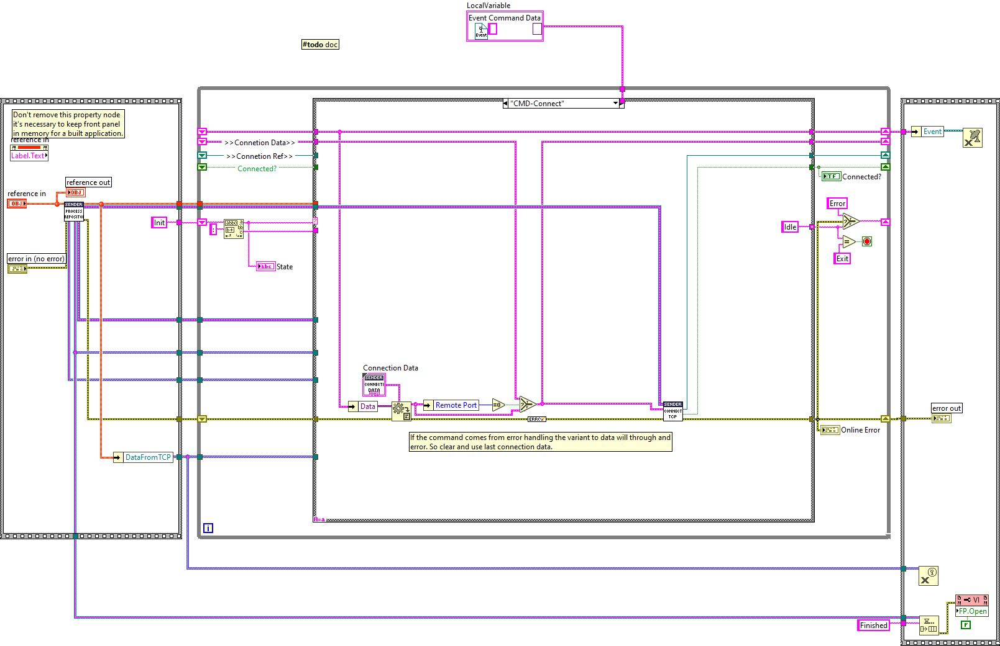

### Task methods

Here the available methods for this task are explained.

#### Sender_Init

Init the sender TCP class.

typeDefName is the name of the data that will be read from the ConfigurationFile
specified in the path

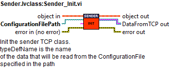

#### CleanUp

CleanUp the sender TCP class.

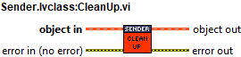

#### ControlProcessWindow

This VI is used to show or hide the process front panel. Depending on the
ShowProcessWindow control value.

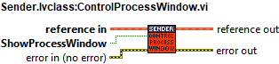

#### GetConnected

Check if the sender is connected to the TCP server

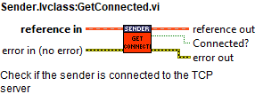

#### SendCloseConn

Send the command to the process to close the connection.

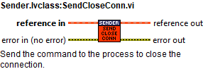

#### SendString

This VI sends the "SendString In" message through TCP and waits for a response
message.

This response message depends on the configuration of the task:

\- If the task is set to NOT wait for TCP responses it will give an empty string
as "Response".

\- If the task is set to wait for TCP responses it will give the response
message as "Response".

For either configuration if an error occurs in the task while trying to send the
data there is no error set in the error line and the following message is
obtained as "Response": Fault when sending data

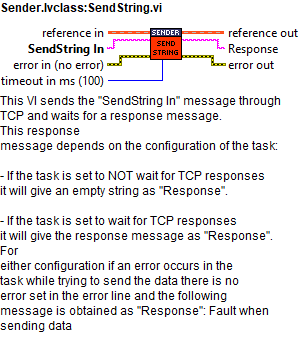

### CMD Reception loop

This loop receives the CMDs from the public methods and executes the required
actions depending on the received command. This loop has a state for each method
as well as some other states used for loop managing, each state is explained in
the next sections.

#### Init

Here the local variables are initialized to the default values.

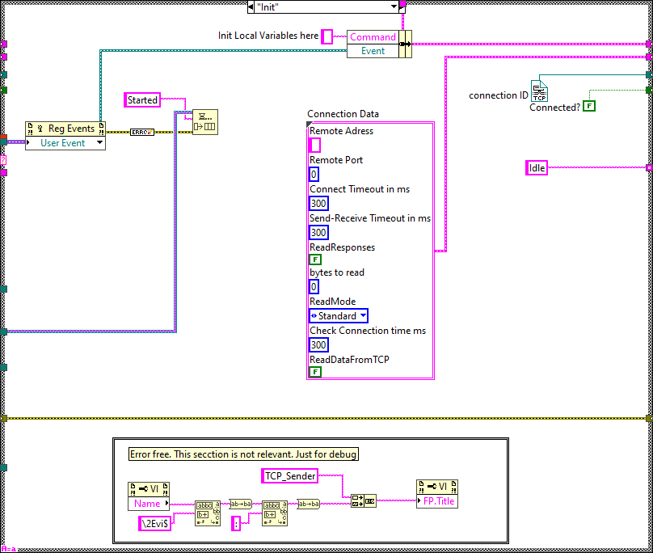

#### Idle

This state is executed constantly after executing every new CMD, here the events
created at the methods are received and executed in the next iteration.

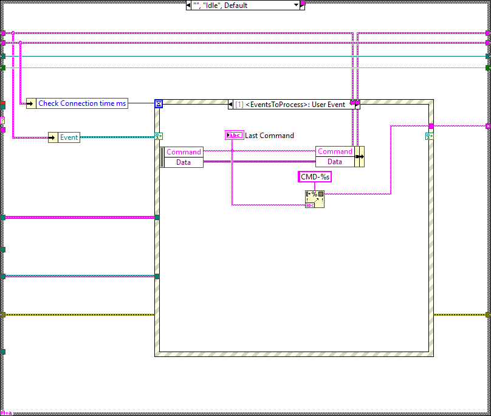

#### Timeout

This state is executed when the CheckConnection time ms time is passed without
any new commands. When this happens the case Timeout is executed and depending
on the configuration it does:

-   If ReadDataFromTCP is set to TRUE: reads the TCP messages and publishes an
    event with the data.

-   If ReadDataFromTCP is set to FALSE: it just checks if the connection is ok.

-   In both cases if the connection is not OK it sends a reconnect to itself,
    see Figure \ref{figuretwelve1be04df075f3f54aa02c427bd084055d}.

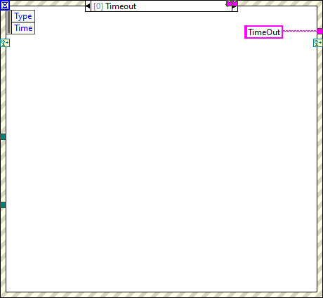

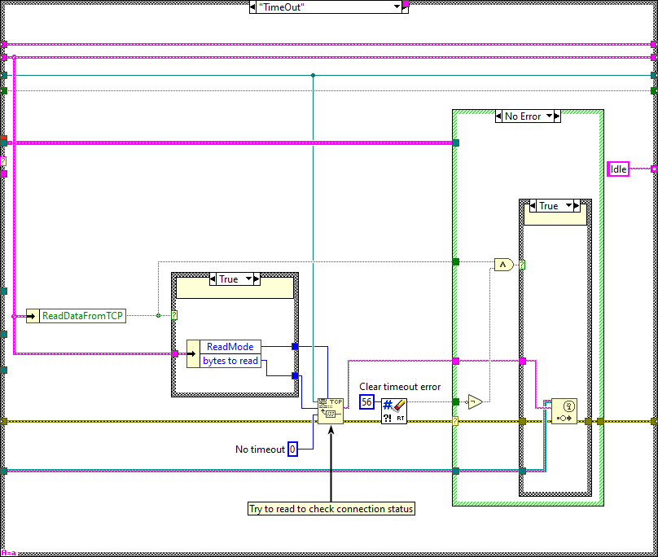

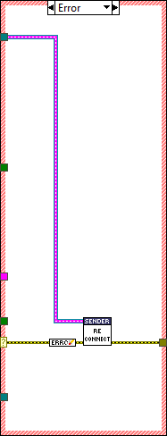

#### CMD-ShowWindow

This state is used to show the front panel of the process.

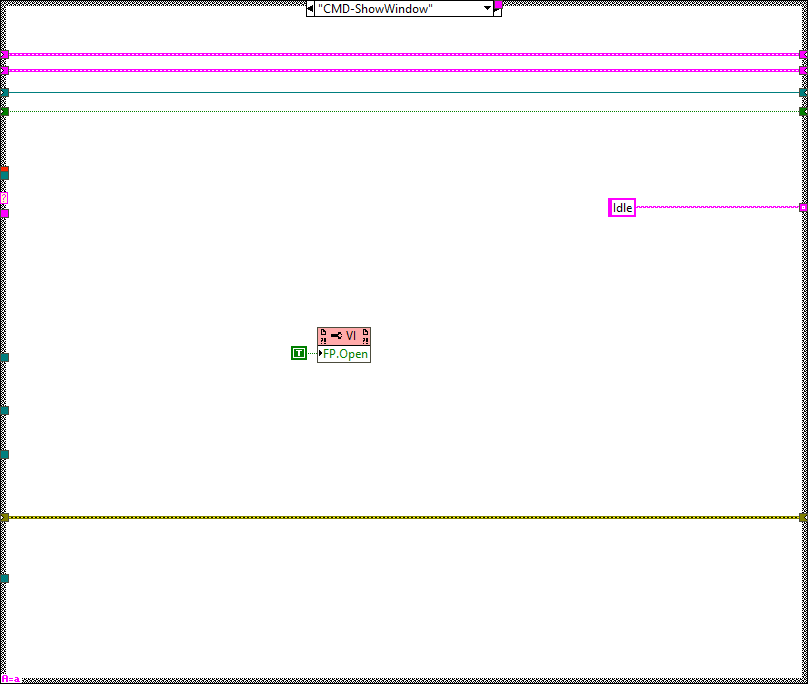

#### CMD-HideWindow

This state is used to hide the front panel of the process.

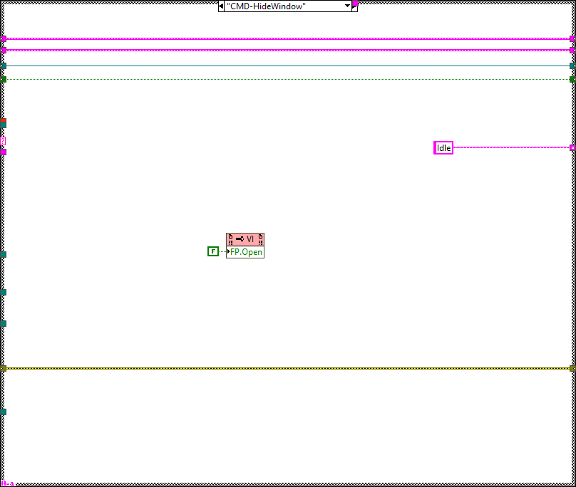

#### CMD-SendString

This case corresponds to the public method SendString, here the message
specified to the method is sent over TCP. Depending on the configuration:

-   If ReadResponses is set to TRUE, the task waits for the time specified as
    “Send-Receive Timeout in ms” to a response message from TCP and sends it to
    the public method in the response queue. See Figure \ref{figuresixteeneb10377e7b097486e35430db315340c4}.

-   If ReadResponses is set to FALSE, %NoResponse% is sent to the public method
    in the response queue.

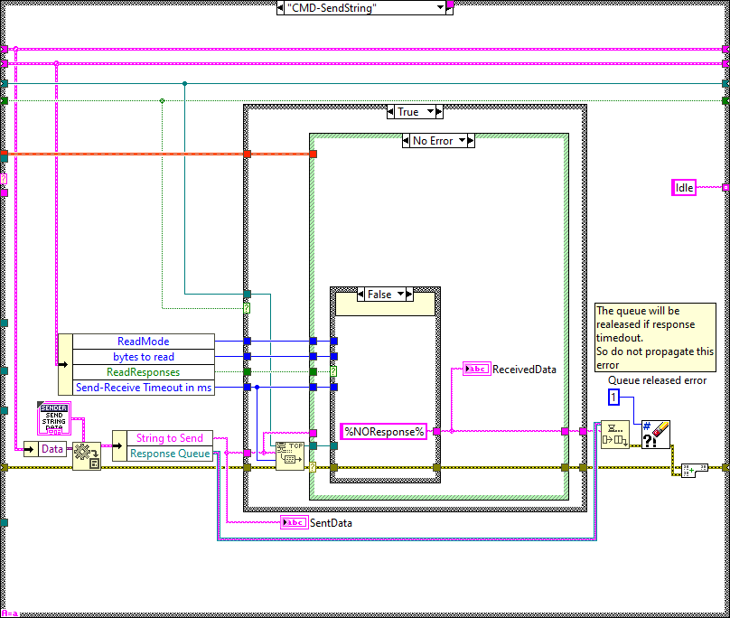

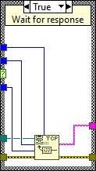

#### CMD-Connect

This case opens the TCP connection to the TCP server, this case is called by the
reconnect private method used within the task.

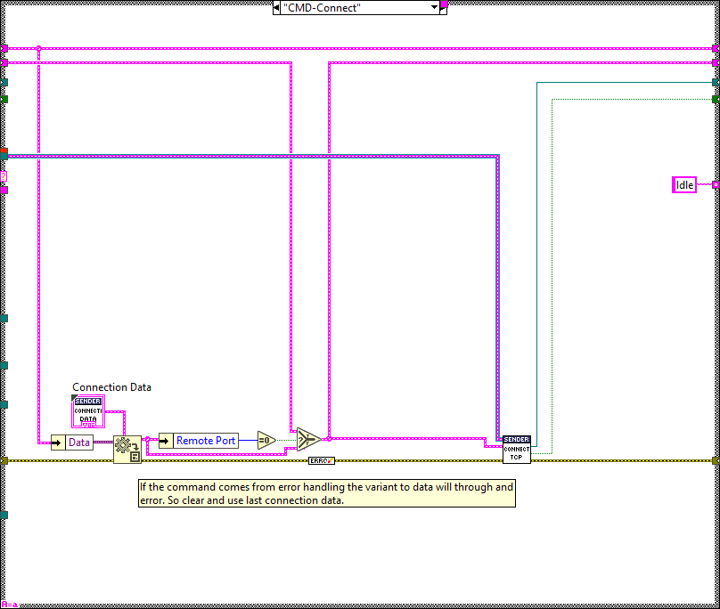

#### CMD-CloseConnection

This case corresponds to the public method SendCloseConn, here the TCP
connection is closed.

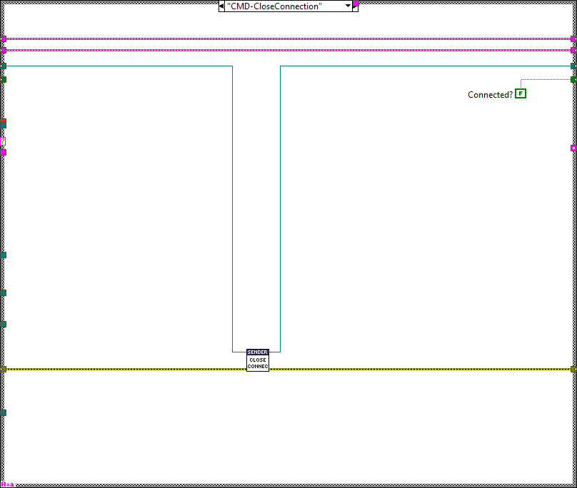

#### CMD-GetConnected

This case corresponds to the public method GetConnected, here the status of the
TCP connection is sent to the public method as a response in a queue.

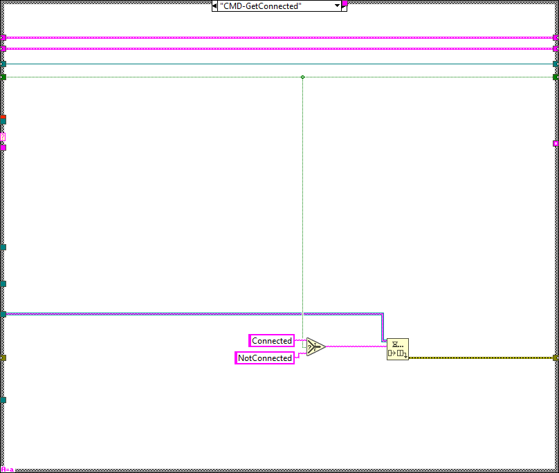

#### CMD-shutdown

This case is used to stop the task, called by the cleanup, here if the TCP
connection is still open it is closed. After that the task stops.

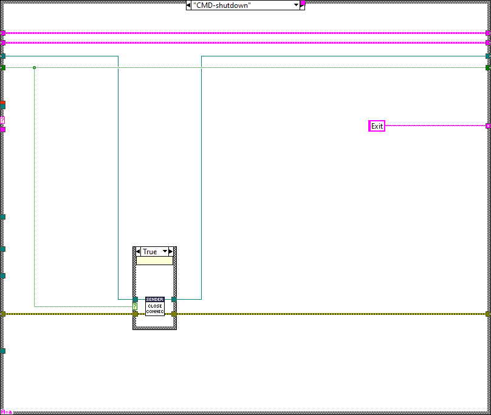

#### Error

This case is used when there is an error in the error line, here the error from
the error line is cleared and if the TCP connection was active it is closed and
the reconnect method is used to open the connection again.

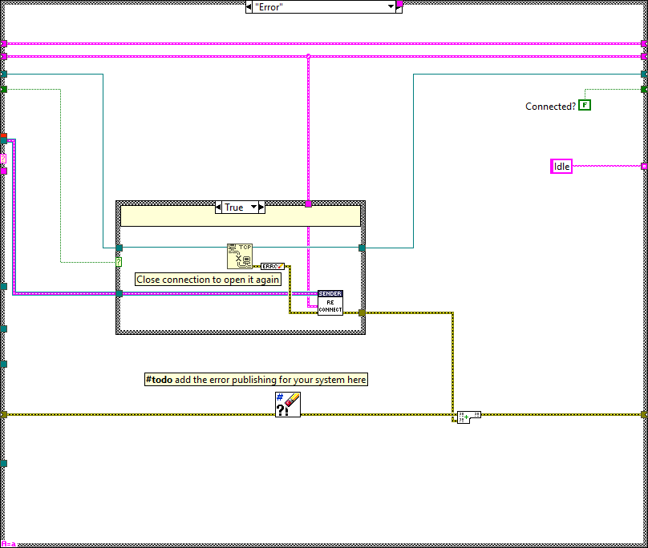

