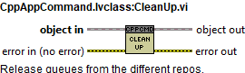

## TMA Commanding

This component is the one sending commands to the TMA and monitoring the events
received from it. This is done using the TCP Client component and some other
tasks that will be explained in this section. This component has two main
different parts:

-   Command sending: this means generating the TCP message to send to the TMA
    using the TCP Client. This is done using the CppAppCommand.lvclass. This
    class is the one that generates the TCP message for each specific command
    and sends them to the TMA using the TCP Client.

-   Event reception: this means getting the messages from the TMA over the TCP
    Client and generating the corresponding events inside the HMI application.
    This is done using the GetEVENTFromTMA.lvclass. This class is responsible of
    parsing the events from the TMA received by the TCP Client and generate the
    corresponding events inside the HMI application.

In addition to these two classes there are two other classes inside the TMA
Commanding component. These are:

-   TMAOMTMonitoring.lvclass: this class is used to monitor the status of the
    TMA received in the “*StateInfo*” events.

-   CommanderCheck.lvclass: this class is used to monitor the actual commander
    and generate the corresponding events to change the user interface and block
    the command sending when the actual HMI is not the commander.

Each of the classes mentioned in above are explained in the upcoming sections.

### CppAppCommand.lvclass

This class is the one that generates the TCP message for each specific command
and sends them to the TMA using the TCP Client. To do so, each subsystem has a
specific class that inherits from the CppAppCommand class and has the specific
commands available for that subsystem. The methods in the parent class, the
CppAppCommand class, are dynamic dispatch and overridden by the child classes.

#### Methods

Here each of the available methods are listed.

##### CppAppCommand_Init

Initialize the command father object, this means initialize the ID repo (for
having an incremental ID different every time), the source repo and the repo for
the TCP Client (the object from the Sender.lvclass that corresponds to the TCP
Client).

Having a repo for each of this values allows the system to work without needing
to pass the parent object to all the windows, it is initialized at the
application launch and the values are stored in the repos and are available just
with an empty object of the parent class.

##### CleanUp

Release queues from the different repos.

##### Enable

Send Enable Command to TMA.

##### Home

Send Command to Perform Home operation

##### Move

Send Move command to TMA

##### MoveVelocity

Send Move Velocity command to TMA

##### ResetAlarm

Send Reset Alarm Command to TMA

##### SendCMD

This VI generates the TCP message for the specified command and with the
specified parameters and sends it to the TCP Client module to send it over TCP
to the TMA. Is meant to be used by the child classes for each of the commands
they have to send.

##### SendPowerCMD

Send power command to TMA

##### Stop

Send Stop to TMA

##### Tracking

Send Tracking Command to TMA

#### Childs

The list of the available childs and the methods that use each of them
correspond to the existing subsystems and the corresponding commands for each
subsystem.

##### CppAppACWCMD.lvclass

This class corresponds to the commands available for the Azimuth Cable Wrap
subsystem, the methods in this class are:

-   EnableTrack

-   Move

-   MoveVelocity

-   ResetAlarm

-   SendPowerCMD

-   Stop

-   TrackTarget

##### CppAppACWDrivesCMD.lvclass

This class corresponds to the commands available for the Azimuth Cable Wrap
drives subsystem, the methods in this class are:

-   Enable

-   ReadDriveIdent

-   ResetAlarm

-   WriteDriveIdent

##### CppAppAZCMD.lvclass

This class corresponds to the commands available for the Azimuth subsystem, the
methods in this class are:

-   Home

-   Move

-   MoveVelocity

-   ResetAlarm

-   SendPowerCMD

-   Stop

-   Tracking

##### CppAppAZDrivesCMD.lvclass

This class corresponds to the commands available for the Azimuth drives
subsystem, the methods in this class are:

-   Enable

-   ReadDriveIdent

-   ResetAlarm

-   WriteDriveIdent

##### CppAppAZThermalCMD.lvclass

This class corresponds to the commands available for the Azimuth drives thermal
subsystem, the methods in this class are:

-   ControlMode

-   ReadAZThermalIdent

-   ResetAlarm

-   SendPowerCMD

-   WriteAZThermalIdent

##### CppAppBALCMD.lvclass

This class corresponds to the commands available for the Balancing subsystem,
the methods in this class are:

-   Enable

-   Move

-   MoveVelocity

-   ReadElementIdent

-   ResetAlarm

-   SendPowerCMD

-   Stop

-   WriteElementIdent

##### CppAppCabinet0101CMD.lvclass

This class corresponds to the commands available for the Cabinet 0101 subsystem,
the methods in this class are:

-   ControlMode

-   ResetAlarm

-   SendPowerCMD

##### CppAppCabinetCMD.lvclass

This class corresponds to the commands available for the Main Cabinet subsystem,
the methods in this class are:

-   ResetAlarm

-   TrackExtTemp

##### CppAppCCWCMD.lvclass

This class corresponds to the commands available for the Camera Cable wrap
subsystem, the methods in this class are:

-   EnableTrack

-   Move

-   MoveVelocity

-   ResetAlarm

-   SendPowerCMD

-   Stop

-   TrackTarget

##### CppAppCCWDrivesCMD.lvclass

This class corresponds to the commands available for the Camera Cable Wrap
drives subsystem, the methods in this class are:

-   Enable

-   MoveVelocity

-   ReadDriveIdent

-   ResetAlarm

-   WriteDriveIdent

##### CppAppCommaderCMD.lvclass

This class corresponds to the commands available for the Commander subsystem,
the methods in this class are:

-   AskCommand

-   PublishOnly

-   SystemReady

##### CppAppDPCMD.lvclass

This class corresponds to the commands available for the Deployable Platform
subsystem, the methods in this class are:

-   LockExtension

-   MoveVelocity

-   ReadPlatformIdent

-   ResetAlarm

-   SendPowerCMD

-   Stop

-   WritePlatformIdent

##### CppAppEIBCMD.lvclass

This class corresponds to the commands available for the Encoder subsystem, the
methods in this class are:

-   ClearHeadsError

-   HardwareReset

-   ReadElementIdent

-   ResetAlarm

-   SendPowerCMD

-   SendReferenceStartCMD

-   SendReferenceStopCMD

-   WriteElementIdent

##### CppAppELCMD.lvclass

This class corresponds to the commands available for the Elevation subsystem,
the methods in this class are:

-   Home

-   Move

-   MoveVelocity

-   ResetAlarm

-   SendPowerCMD

-   Stop

-   Tracking

##### CppAppELDrivesCMD.lvclass

This class corresponds to the commands available for the Elevation drives
subsystem, the methods in this class are:

-   Enable

-   ReadDriveIdent

-   ResetAlarm

-   WriteDriveIdent

##### CppAppELThermalCMD.lvclass

This class corresponds to the commands available for the Elevation drives
thermal subsystem, the methods in this class are:

-   ControlMode

-   ReadELThermalIdent

-   ResetAlarm

-   SendPowerCMD

-   WriteELThermalIdent

##### CppAppLPCMD.lvclass

This class corresponds to the commands available for the Locking Pins subsystem,
the methods in this class are:

-   LP_Free

-   LP_Lock

-   LP_Test

-   Move

-   MoveVelocity

-   ReadPinIdent

-   ResetAlarm

-   SendPowerCMD

-   Stop

-   WritePinIdent

##### CppAppMainAxesCMD.lvclass

This class corresponds to the commands available for the Main Axes subsystem,
the methods in this class are:

-   MoveToTarget

-   Stop

-   TrackTarget

##### CppAppMCCMD.lvclass

This class corresponds to the commands available for the Mirror Cover subsystem,
the methods in this class are:

-   MCClose

-   MCOpen

-   Move

-   MoveVelocity

-   ReadSectorIdent

-   ResetAlarm

-   SendPowerCMD

-   Stop

-   WriteSectorIdent

##### CppAppMCLCMD.lvclass

This class corresponds to the commands available for the Mirror Cover Locks
subsystem, the methods in this class are:

-   MCL_Close

-   MCL_Open

-   Move

-   MoveVelocity

-   ReadMirrorLockIdent

-   ResetAlarm

-   SendPowerCMD

-   Stop

-   WriteMirrorLockIdent

##### CppAppModbusTempControllersCMD.lvclass

This class corresponds to the commands available for the Modbus Temperature
Controllers subsystem, the methods in this class are:

-   FanPower

-   ReadDriveIdent

-   ResetAlarm

-   Setpoint

-   WriteDriveIdent

##### CppAppMPSCMD.lvclass

This class corresponds to the commands available for the Main Power Supply
subsystem, the methods in this class are:

-   ResetAlarm

-   SendPowerCMD

##### CppAppOSSCMD.lvclass

This class corresponds to the commands available for the Oil Supply System
subsystem, the methods in this class are:

-   ResetAlarm

-   SendAbortPoweringCMD

-   SendChangeModeCMD

-   SendCoolingPowerCMD

-   SendMainPumpPowerCMD

-   SendOilPowerCMD

-   SendPowerCMD

##### CppAppSafetyCMD.lvclass

This class corresponds to the commands available for the Safety subsystem, the
methods in this class are:

-   SafetyReleaseOverride

-   SafetyReset

-   SafetySetOverride

##### CppAppTECCMD.lvclass

This class corresponds to the commands available for the Top End Chiller
subsystem, the methods in this class are:

-   ResetAlarm

-   SendPowerCMD

-   TrackExtTemp

##### CppAppTFCMD.lvclass

This class corresponds to the commands available for the Transfer Function
subsystem, the methods in this class are:

-   ExcitationConfig

-   ResetAlarm

GetEventfromTMA.lvclass
-----------------------

This class is responsible of parsing the events from the TMA received by the TCP
Client and generate the corresponding events inside the HMI application.

#### Task process

This task was created using the NI GOOP Developing Suite, this task is object
oriented and the communication between methods is done using queues and user
events. The task main is contained in the process.vi, here there is one loop.
The loop is used for CMD reception, see Figure \ref{figurethirty-three69459e04fb4b90c71b521567c9afc8ef}. This process has only one
instance that manages all the received events from the TMA.

#### Task methods

Here the available methods for this task are explained.

##### GetEVENTFromTMA_Init.vi

Initialize the process to hear from TMA OMT.

The initialized process will get ACK, DONE, ERROR and WARNINGS that come from
the TMA (operation_manager). It will also get the state change and error from
the TMA OMT (operation_manager) itself.

##### CleanUp

Stop task process and destroy user events.

##### ControlProcessWindow

This VI is used to show or hide the process front panel. Depending on the
ShowProcessWindow control value.

##### GetEventRefs

This VI is used to return the references to the different events: ack, done,
error and warning.

#### CMD Reception loop

This loop receives the commands from the public methods and executes the
corresponding actions. This loop has a state for each method as well as some
other states used for loop managing, each state is explained in the next
sections.

##### Init

This state is just executed once and is the first executed one. Here the
initialization actions are executed. These are:

-   Initialization of local variable

-   Registration of events for the event structure

-   Updating the displayed name of the VI for debug purposes

##### Idle

This state is executed constantly after executing every new CMD, here the events
created at the methods are received and executed in the next iteration, in the
event called "EventsToProcess" see Figure \ref{figureforty0ffa46f585c98b683a6134b3b50cf30d}.

In addition to this, the TCP messages received from the TCP Client as user
events are received and parsed, the event that receives the TCP messages is
called “DataFromTCP” see Figure \ref{figureforty-onef00e25525f869863dacc2c4672994d39}. The TCP messages are parsed and the
appropriate user events are generated, these events are:

-   Ack event: this event is used to transmit the received ack or no ack events.

-   Done event: this event is used to transmit the done events.

-   Error event: this event is used to transmit the received fault events.

-   Warning event: this event is used to transmit the received warning events.

-   Version event: this event is used to transmit the version from the TMA.

With some messages no user events are generated. These cases are:

-   StateInfo: when this message is received the state of the TMA is updated
    using the methods from the TMAOMTMonitoring.lvclass. For “State” submessages
    from the StateInfo messages the state of the TMA statemachine must be
    updated, to do so the PublishTMAOMTState method from the
    CommanderCheck.lvclass is used.

-   InPosition: not used in the HMI application.

##### Timeout

This state is executed when there is something that must be executed in the
specified timeout of the Idle state event structure, see Figure \ref{figureforty-twoffea54a30df54a93c2d371689872356d}.

##### ShowWindow

This state is used to show the front panel of the process.

##### HideWindow

This state is used to hide the front panel of the process.

##### Shutdown

This state is reached when the shutdown CMD is received. This loop is used to
stop the CMD receiver loop.

##### Error

This state is reached when an error occurs at the task, here the error is
published and cleared for the next iteration.

TMAOMTMonitoring task
---------------------

To be updated

This task is responsible of monitoring the TMA OMT status.

Here the CSC connection status, CSC commands, CSC Events and TMA OMT actual
state are received and saved.

#### Task process

This task was created using the NI GOOP Developing Suite, this task is object
oriented and the communication between methods is done using queues and user
events. The task main is contained in the process.vi, here there is a single
loop. This loop contains both the CMD reception and the CMD actions execution.
This process has only one instance that manages all the received data.

#### Task methods

Here the available methods for this task are explained.

##### TMAOMTMonitoring_Init.vi

This VI is used to launch the process.

##### CleanUp

This VI is used to stop the task and release all the references generated for
this task.

##### ControlProcessWindow

This VI is used to show or hide the process front panel. Depending on the
ShowProcessWindow control value.

##### NewTMAState

This VI is used to send the new TMA OMT state string to the process and update
the memory.

##### SetTCSCommStatus

This VI is used to send the TCS connection status to the process and update the
memory.

##### GetTMAStatus

This VI is used to get the status of the TMA OMT from the task.

##### NEWTCSCmd

This VI is used to send the last command received from the TCS to the process
and update the memory.

##### GetCMDHistory

This VI is used to get the last 100 CMDs received from the TCS.

##### GetEventHistory

This VI is used to get the last 100 events received from the TCS.

##### NEWTCSEvent

This VI is used to send the last event received from the TCS to the process and
update the memory. This is not used for error or waring events.

#### Main loop

This loop receives the CMDs from the methods and executes them in the same loop.
The different states of the loop are explained in the following sections.

##### Init

Here the initialization actions are executed.

##### Idle

This state is executed constantly after executing every new CMD, here the events
created at the methods are received and executed in the next iteration.

##### Timeout

This state is executed when there is something that must be executed in the
specified timeout of the Idle state event structure, see Figure \ref{figuresixty-one5a9d7a30173c7114968eb1d6689ee85b}.

##### ShowWindow

This state is used to show the front panel of the process.

##### HideWindow

This state is used to hide the front panel of the process.

##### NEWTMAStateSendEVENT

This state is executed when the NEWTMAState method is used. Here the received
string from the calling method is saved into the TMA Status Local Var register
as current state.

##### SetConnStatus

This state is executed when the SetTCSCommStatus method is used. Here the
received boolean from the calling method is saved into the TMA Status Local Var
register as current connection status.

##### NewTCSCMD

This state is executed when the NewTCSCMD method is used. Here the received
structure from the calling method is saved into the CMD history queue and TMA
Status Local Var register as last CMD.

##### NewTCSEvent

This state is executed when the NewTCSEvent method is used. Here the received
structure from the calling method is saved into the Event history queue and TMA
Status Local Var register as last CMD.

##### GetStatus

This state is executed when the GetTMAStatus method is used. Here the TMA Status
Local Var register value is used as response to the calling method, the response
is given at the “QueueFromProcess” queue.

##### GetCMDHistory

This state is executed when the GetCMDHistory method is used. Here the CMD
History queue elements are used as response to the calling method, the response
is given at the “QueueFromProcess” queue.

##### GetEventHistory

This state is executed when the GetEventHistory method is used. Here the Event
History queue elements are used as response to the calling method, the response
is given at the “QueueFromProcess” queue.

##### Error

This state is reached when an error occurred at the loop. Here the error is
posted to the event from process to be handled by the general error handler.

##### Shutdown

This state is reached when the shutdown CMD is received. This loop is used to
stop the loop and close the connection to the TMA OMT.

CommanderCheck task
-------------------

To be updated

This task will be waiting for commands form outside and, in the timeout, will
check the actual commander var. If the commander has changed an event will be
placed in Events from process with new data.

#### Task process

This task was created using the NI GOOP Developing Suite, this task is object
oriented and the communication between methods is done using queues and user
events. The task main is contained in the process.vi, here there is a single
loop. This loop contains both the CMD reception and the CMD actions execution.
This process has only one instance that manages all the received data.

#### Task methods

Here the available methods for this task are explained.

##### CommanderCheck_Init

This VI is used to launch the process, to do so some inputs are required:

-   Commander Variable URL: a string with the URL of the CommanderVariable that
    the process will use to know if the commander has changed and how is the new
    commander.

-   Status Variable URL: a string with the URL of the Status Variable that the
    process will use publish the last TMA OMT status.

##### CleanUp

This VI is used to disconnect vars, stop the task and release all the references
generated for this task.

##### ControlProcessWindow

This VI is used to show or hide the process front panel. Depending on the
ShowProcessWindow control value.

##### GetCommander

This VI is used to get the current commander. It also tells if the status is
valid or not, but only after the first read of the variable is done.

##### DisconnectVars

This VI is used to disconnect the shared variables used by the task.

##### ConnectVars

This VI is used to connect the shared variables used by the task.

##### GetCommanderEventRef

This VI is used to get the ref to the events triggered by the task.

##### PublishTMAOMTState

This VI is used to send the last TMA OMT state to the process and update the
Status Variable.

##### ActivateChecking

This VI is used to activate or de activate the checking of the commander.

#### Main loop

This loop receives the CMDs from the methods and executes them in the same loop.
The different states of the loop are explained in the following sections.

##### Init

Here the initialization actions are executed.

##### Idle

This state is executed constantly after executing every new CMD, here the events
created at the methods are received and executed in the next iteration.

##### Timeout

This state is executed when there is something that must be executed in the
specified timeout of the Idle state event structure. In this timeout, see Figure
87, the commander is checked by reading the commander variable. If this variable
has new data a commander change event is triggered.

##### ShowWindow

This state is used to show the front panel of the process.

##### HideWindow

This state is used to hide the front panel of the process.

##### ConnectVars

This state is executed when the ConnectVars method is used. Here the variable
references specified at the init are connected.

##### DisconnectVars

This state is executed when the DisconnectVars method is used. Here the variable
references are disconnected.

##### GetCommander

This state is executed when the GetCommander method is used. Here the actual
commander register is used as response to the calling method, the response is
given at the “QueueFromProcess” queue.

##### PublishState

This state is executed when the PublishTMAOMTState method is used. Here the
string specified at the method is written to the status connection variable.

##### ActivateChecking

This state is executed when the ActivateChecking method is used. Here the
Boolean value specified to the method is used to set the value of the
CheckCommander? Local variable.

##### Error

This state is reached when an error occurred at the loop. Here the error is
posted to the event from process to be handled by the general error handler.

##### Shutdown

This state is reached when the shutdown CMD is received. This loop is used to
stop the loop and close the connection to the variables.

