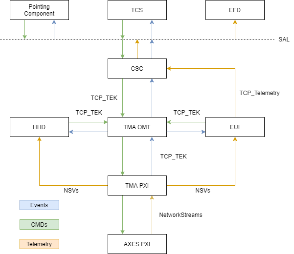

# HMI Structure

The Human Machine Interface (HMI) is an important part of the overall system, as
seen in Figure \ref{figureone350f30df820b4ef01f38b7cadcba9985} where the HMI code corresponds to the EUI (Engineering User
Interface) and the HHD (Handheld Device) labels. It contains important code that
makes the system work properly, as well as allowing advanced users to adjust the
system or execute maintenance operations.

Focusing only in the HMI part, the Figure \ref{figureone350f30df820b4ef01f38b7cadcba9985} simplifies to the Figure \ref{figuretwo3d62584b986c8ac035e591e474694ccc}, having
the components of the HMI divided and the relation between the different
elements explained. Al the components inside the HMI Components box are coded in
LabVIEW and compiled together as the EUI, for both the HHD and the MCC, with
some variations as the screen size is different for each case.

As shown in Figure \ref{figuretwo3d62584b986c8ac035e591e474694ccc}, the components of the HMI are:

- TCP Client: this component is the one that connects to the TMA over TCP to
 send and receive the TCP messages. The message to send is specified to the
 task by a public method of the TCP client object, and the received messages
 are published in a user event created when the object is initialized.

- TMA Commanding: this component is the one sending commands to the TMA and
 monitoring the events received from it. This is done using the TCP Client
 component.

- Alarm Management: this component gets the alarm and warning events from the
 TCP client, logging the received alarms and warnings to have a record of the
 different events occurred while operating the system.

- User Management: as there are some actions that can be performed from the
 HMI (EUI or HHD) that can be dangerous for both the machine and the people
 around the system, a user based control is used to avoid certain operations
 to low level users.

- Telemetry Management: the telemetry generated by the PXIs must be stored
 locally, the files are stored in the EUI, and sent to the CSC.

- User Interface: the one that the user sees and interacts with.

Each of the components is explained in detail in the following sections.
