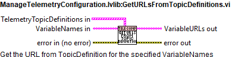
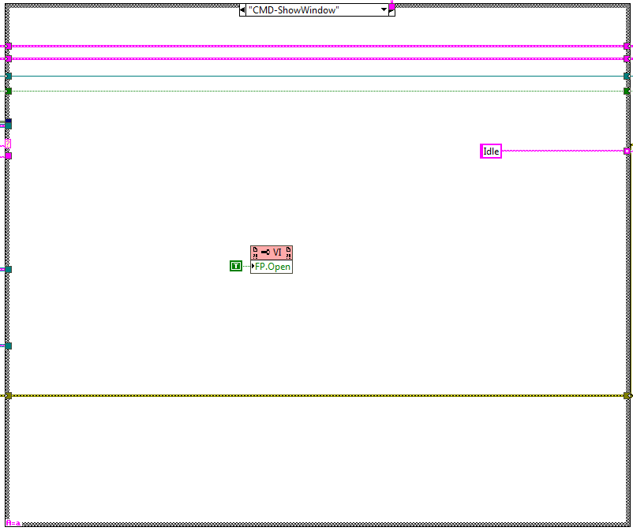
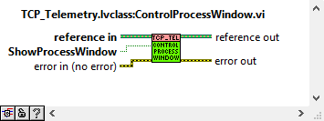

# Telemetry Management

The telemetry must perform the following actions:

- Get Data from real time PXI.

- Save data locally for two days. And only two days.

- Send data to TCS every 50 ms. (this can be configured by topic in the
  configuration file)

The mentioned actions are performed by two different tasks. One for getting the
data and saving it locally, this task is called Telemetry logging task. The
other for sending the received data to the TCS, this task is called
TCP_Telemetry. These two tasks are explained in the next sections.

- Telemetry logging task: This task is the one obtaining the data from the
  PXI.

- TCP Telemetry task: This task is responsible of sending all the needed
  telemetry to the CSC over TCP.

This document also contains the documentation of the configuration files for the
telemetry. These files are:

- Topic Telemetry configuration file: defines all the telemetry to get from
  the PXI classified by topic, default name:
  “TelemetryTopicsConfiguration.ini”.

- Window Telemetry configuration file: defines the telemetry to display in
  each window, default name: “HMIWindowsTelemetryVariables.ini”.

## Telemetry configuration

### Topic Telemetry configuration file

For telemetry definition there is a configuration file
“*TelemetryTopicsConfiguration.ini*” in the configuration folder that defines
all the telemetry to get from the real time target classified by topic.

The file has sections according to each topic, so each topic data is configured
in the same place. In each section, there are 7 possible data types available:
BOOL, DBL, DBL Array, Int32, String, String Array and Int64 Array, where DBL
Array and Int64 Array are for high speed signals of DBLs and Int64. Each of the
7 data types correspond to an already coded class in the Telemetry Logging task,
if any other data type is required new code must be added to read and process
that new data type.

The structure used in the “*TelemetryTopicsConfiguration.ini*” file is the one
generated by OpenG Variant Configuration file palette Vis when managing clusters
and arrays. Each data type has as many elements as defined by “\<size(s)\>”, 0
means that this topic has no data of this type. The cluster has 5 fields for
each variable that will be read from the PXI:

- URL: This field defines the url of the network shared variable to read. This
  is the real identification of the topic since this is unique.

- Unit: Units of the data. This data will be added to the saved files.

- Comments: In this field some comments could be added. This data will be
  added to the saved files.

- TCP_PublishName: here the name that will be used when publishing the data
  over TCP is specified.

- TCP_Publish: this is a Boolean value, FALSE or TRUE that enables or disables
  the the publication of the variable over TCP.

Boolean and DBL Array data type examples:

> *Boolean Telemetry Data.\<size(s)\> = "2"*

> *Boolean Telemetry Data 0.url =
> "psp://192.168.209.10/SafetyModbusComm/AZlimP"*

> *Boolean Telemetry Data 0.Unit = ""*

> *Boolean Telemetry Data 0.Comments = "Azimuth Positive power off limit
> switch AND topple block pos A"*

> *Boolean Telemetry Data 0.TCP_PublishName = "aZlimP"*

> *Boolean Telemetry Data 0.TCP_Publish = "FALSE"*

> *Boolean Telemetry Data 1.url =
> "psp://192.168.209.10/SafetyModbusComm/AZlimN"*

> *Boolean Telemetry Data 1.Unit = ""*

> *Boolean Telemetry Data 1.Comments = "Azimuth Negative power off limit
> switch AND topple block pos B"*

> *Boolean Telemetry Data 1.TCP_PublishName = "aZlimN"*

> *Boolean Telemetry Data 1.TCP_Publish = "FALSE"*

> *DBL Array Telemetry Data.\<size(s)\> = "24"*

> *DBL Array Telemetry Data 0.url = "psp://192.168.209.10/PXIComm_NSV/Azimuth
> Angle Actual"*

> *DBL Array Telemetry Data 0.Unit = "deg"*

> *DBL Array Telemetry Data 0.Comments = "Actual position for azimuth axis"*

> *DBL Array Telemetry Data 0.TCP_PublishName = "azimuthAngleActual"*

> *DBL Array Telemetry Data 0.TCP_Publish = "TRUE"*

> *DBL Array Telemetry Data 1.url = "psp://192.168.209.10/PXIComm_NSV/Azimuth
> Controller Angle Set"*

> *DBL Array Telemetry Data 1.Unit = "deg"*

> *DBL Array Telemetry Data 1.Comments = "Actual setpoint of azimuth axis"*

> *DBL Array Telemetry Data 1.TCP_PublishName = "azimuthAngleSet"*

> *DBL Array Telemetry Data 1.TCP_Publish = "TRUE"*

Apart of the variables, each topic also includes the configuration for TCP
publication as a topic. For configuring this there are two values:

- TopicID: the identifier of the topic, this will be published as part of the
  tCP message to identify the Topic.

- TopicFrequencyMultiple50ms: this value is used to configure the publication
  frequency of the topic.

### Window Telemetry configuration file

For window telemetry definition there is a configuration file
“*HMIWindowsTelemetryVariables.ini*” in the configuration folder that defines
the telemetry to display in each window.

The file has sections according to each window, so each window reads this file
to know which variables are needed for the window, this variables are then
searched in the Topic Telemetry configuration file to get the URL that
corresponds to each variable. In each section, there are 7 possible data types
available, the same data types defined in the Topic Telemetry configuration file
(see previous section).

The structure used in the “*HMIWindowsTelemetryVariables.ini*” file is the one
generated by OpenG Variant Configuration file palette Vis when managing arrays.
An example for the Azimuth cAble wrap is as follows:

> *[Azimuth Cable Wrap]*

> *String Telemetry Variables.\<size(s)\> = "3"*

> *String Telemetry Variables 0 = "PXIComm_NSV/ACW Status"*

> *String Telemetry Variables 1 = "PXIComm_NSV/ACW Status Drive 1"*

> *String Telemetry Variables 2 = "PXIComm_NSV/ACW Status Drive 2"*

> *DBL Telemetry Variables.\<size(s)\> = "0"*

> *DBL Array Telemetry Variables.\<size(s)\> = "7"*

> *DBL Array Telemetry Variables 0 = "PXIComm_NSV/ACW Angle 1"*

> *DBL Array Telemetry Variables 1 = "PXIComm_NSV/ACW Angle 2"*

> *DBL Array Telemetry Variables 2 = "PXIComm_NSV/Azimuth Angle Actual"*

> *DBL Array Telemetry Variables 3 = "PXIComm_NSV/ACW Speed 1"*

> *DBL Array Telemetry Variables 4 = "PXIComm_NSV/ACW Speed 2"*

> *DBL Array Telemetry Variables 5 = "PXIComm_NSV/CCW Current 1"*

> *DBL Array Telemetry Variables 6 = "PXIComm_NSV/CCW Current 2"*

> *Boolean Telemetry Variables.\<size(s)\> = "3"*

> *Boolean Telemetry Variables 0 = "PXIComm_NSV/ACW Positive Direcctional
> limit Switch"*

> *Boolean Telemetry Variables 1 = "PXIComm_NSV/ACW Negative Direcctional
> limit Switch"*

> *Boolean Telemetry Variables 2 = "SafetyModbusComm/stoAZCW"*

> *String Array Telemetry Variables.\<size(s)\> = "1"*

> *String Array Telemetry Variables 0 = "PXIComm_NSV/ACW Interlocks"*

> *INT32 Telemetry Variables.\<size(s)\> = "0"*

> *Int64 Array Telemetry Variables.\<size(s)\> = "0"*

### Telemetry Configuration from Files Initialization

For reading and initializing the telemetry configuration from the previous
mentioned 2 files there is a VI. This VI is explained in this section as it is
assumed to be important.

#### VI description

Read the configuration files for the telemetry and initialize the FGV that will
save the configuration for each execution.

#### Block diagram

#### List of subVIs

- GetTelemetryURLPath.vi: Gets the telemetry logging directory path and
  creates if missing

- ManageTelemetryConfiguration.lvlib:FGV_TelemetryTopicsDefinitions.vi: FGV
  for window telemetry URLs

- ManageTelemetryConfiguration.lvlib:FGV_WindowTelemetryURLs.vi: FGV for
  window telemetry URLs

- ManageTelemetryConfiguration.lvlib:GetURLsForVariables.vi: Here the URL that
  corresponds to each variable type is obtained.

- ManageTelemetryConfiguration.lvlib:GetURLsFromTopicDefinitions.vi: Get the
  URL from TopicDefinition for the specified VariableNames

- ManageTelemetryConfiguration.lvlib:ItemNotFoundError.vi: Here the error is
  set explaining which item was not found while reading the TelemetryTopic
  configuration

- ManageTelemetryConfiguration.lvlib:ReadTelemetryTopicsConfigFile.vi: Read
  topics configuration file and save the read data into a FGV.

- ManageTelemetryConfiguration.lvlib:ReadWindowTelemetryURLs.vi: Reads the
  config file containing all the diferent URLs for all the requiered telemetry
  and adds this URLs to a FGV

- NI_LVConfig.lvlib:Close Config Data.vi: Writes data to the
  platform-independent configuration file identified by refnum and then closes
  the reference to that file.

- NI_LVConfig.lvlib:Get Section Names.vi: Gets the names of all sections from
  the configuration data identified by refnum.

- NI_LVConfig.lvlib:Open Config Data.vi: Opens a reference to the
  configuration data found in a platform-independent configuration file.

- Read Key (Variant)__ogtk.vi: Reads a value associated with key in a
  specified section of the configuration data identified by refnum. If "key"
  input is not specified, the name of the variant object is used as the key.
  the "found?" output will be TRUE for compount objects (clusters) only if all
  elements (recursively) are found. For example a Boolean named "Enable" with
  a value of TRUE would correspond to the key-value pair: Enable=TRUE Note:
  Special characters in section and key names will be escape-coded. These
  include the following: \\00-\\1F (non-printable chars); "[", "]", and "="
  (INI syntax elements); \\FE ("þ") and \\FF ("ÿ") (legacy bracket encoding);
  Additionally, the escape character, "\\", will be escaped as "\\\\".

## Telemetry logging task

This task is the one obtaining the data from the PXI. This task does two main
things:

1. Read the data from the PXI and store it in memory. To be accessible by the
  rest of tasks/windows that may need the data.

2. Save the read data in TDMS format locally, as said before for 2 days. This
  files after a certain time are zipped (conversion to \*.zip) to reduce space
  in the hard drive.

For doing this the variables are read from the PXI using the URLs defined at the
Topic Telemetry configuration file. Part of this task is also configured using
the “*HMIConfig.xml*” file, as it is considered to be general configuration and
not topic specific configuration. The configuration values obtained from that
file are:

- File_Saving_directory_path: this is a relative path starting at the project
  location.

- HMIWindowsTelemetryVariables_file_path: here the absolute path to the Window
  Telemetry configuration file is specified.

- TelemetryTopics_file_path: here the absolute path to the Topic Telemetry
  configuration file is specified.

- DataAcquieringLoopFrequency_ms: this value corresponds to the timing of the
  acquisition loop of the telemetry variables in mili seconds.

- Telemetry_Decimate_Save: this value is used to avoid overloading when
  saving, this value is used to divide the saving into bigger arrays to save
  into the TDMS, the value corresponds to the iteration multiple of the data
  acquisition loop. This means that with a default value of 10 the arrays with
  50 values obtained every 50 ms are saved every (10\*50ms) 500 ms in arrays
  of 500 values size.

- TelemetryTaskConfig.DataHistoryDays: this value corresponds to the maximum
  value of stored data in days. The default value is 2, this means that files
  older than 2 days will be erased.

- TelemetryTaskConfig.SecondsToLeaveUnZipped: this value, in seconds,
  corresponds to the minimum time for TDMS files to be unzipped. This means
  that the last TDMS to be zipped will be the actual time minus this value.
  With the default value of 3600, means that there will be unzipped files for
  the last hour.

### Task process

This task was created using the NI GOOP Developing Suite, this task is object
oriented and the communication between methods is done using queues and user
events. The task main is contained in the process.vi, here there are 6 loops.

- The loop on top is used for CMD reception.

- The Data acquiring loop, is the one reading the network shared variables
  from the PXI.

- The Data saving loop, is the one that writes the acquired data to TDMS.

- The Check variables connection loop, this loop is used to reconnect the
  variables that may fail when read in the Data acquiring loop.

- UpdateActualData loop, this loop gets the data from the Data acquiring loop
  and stores it into a DVR to be accessible by other tasks.

- SendActualDataEvent loop, this event gets the data from the Data acquiring
  loop and publishes an event with the DBL and DBL Array data types. This
  event is used in the windows only, to plot the values into graphs.

#### CMD Reception loop

This loop receives the CMDs from the methods and passes the required actions to
the corresponding loop.

##### Init

Here the initialization actions are executed.

##### Idle

This state is executed constantly after executing every new CMD, here the events
created at the methods are received and executed in the next iteration.

##### Timeout

This state is executed when there is something that must be executed in the
specified timeout of the Idle state event structure.

##### CMD-ShowWindow

This state is used to show the front panel of the process.

##### CMD-HideWindow

This state is used to hide the front panel of the process.

##### CMD-AddVariable

Verify if the variable exists, if not the variable is connected and added other
ways not.

##### CMD-AddVariableHHD

Verify if the variable exists, if not the variable is connected but NOT ADDED,
this would be made by another method that will add only the variables needed for
the loaded window.

##### CMD-MonitorVariablesHHD

Verify if the variable exists, if not the variable is added other ways not. If
monitor is true, the variable is added for monitoring if false its removed from
monitoring.

##### CMD-Adquisition

Manage the variables acquisition, start or stop it.

##### CMD-ChangeSaveFilePath

Change the path for saving the telemetry, send the new path to the Data Saving
Loop.

##### CMD-SaveData

Manage the data saving, start or stop it.

##### CMD-Error

Get the error and set it to the error line, this will make the task to go to the
Error case and process it there.

##### Error

Send the error from the error line to the Error Task.

##### CMD-Shutdown

Here the actions to shutdown the task are executed.

#### Data Acquiring Loop

The Data acquiring loop, is the one reading the network shared variables from
the PXI. This loop then sends the data to the other loops to manage it as
intended in each case.

#### Data Saving Loop

The Data saving loop, is the one that writes the acquired data to TDMS.

#### Check Variables Connection Loop

The Check variables connection loop, this loop is used to reconnect the
variables that may fail when read in the Data acquiring loop.

#### Update Actual Data Loop

Update Actual Data loop, this loop gets the data from the Data acquiring loop
and stores it into a DVR to be accessible by other tasks.

#### Send Actual Data Event loop

Send Actual Data Event loop, this event gets the data from the Data acquiring
loop and publishes an event with the DBL and DBLarray data types. This event is
used in the windows only, to plot the values into graphs.

### Task methods

Here the available methods for this task are explained.

#### AddVariableMethodChoice

This method selects which add variable method must be used depending on the
current device Global variable (EUI or HHD).

#### AssignInitClasses

Here the telemetry variable objects are initialized using the
TelemetryTopicDefinitions.

#### ChangeFileSavingPath

Change the file path to save the telemetry data

#### CleanUp

execute the clean up actions for the task

\- Stop the process.vi

\- Release queues

\- Destroy user events

\- Delete DVRs

#### GetAllTelemetry

Returns the data from the actualDataDVR

#### GetTelemetryDataURL

Returns the data from the queue

#### ManageAdquisition

Manages the adquisition of the telemetry task

#### ManageSaveData

Turns on or off the telemetry data saving to file (tdms).

#### MonitorVariablesHHD

Adds a variable to the telemetry task for the HHD system

#### Read TelemetryEvent

Gets the TelemetryEvent reference from the class object

#### TelemetryFilePathCreation

Generates the path to save the telemetry data for each 10 minutes

#### TelemetryLogingTask_Init

Initialize the telemetry process. Also includes the compression of old telemetry
files (TDMS) onto zip files.

## TCP Telemetry task

This task is responsible of sending all the needed telemetry to the CSC over
TCP.

### Task process

This task was created using the NI GOOP Developing Suite, this task is object
oriented and the communication between methods is done using queues and user
events. The task main is contained in the process.vi, here there are two loops.
The loop on top is used for CMD reception and the bottom one for publishing.
This process has only one instance that manages all the telemetry data.

#### CMD Reception loop

This loop receives the CMDs from the methods and passes the required actions to
the publishing loop.

##### Init

Here the initialization actions are executed.

##### Idle

This state is executed constantly after executing every new CMD, here the events
created at the methods are received and executed in the next iteration.

##### Timeout

This state is executed when there is something that must be executed in the
specified timeout of the Idle state event structure, see Figure \ref{figurefifty-onef7565b74148bf04cd1f4f1fb69d642c1}.

##### CMD-ShowWindow

This state is used to show the front panel of the process.

##### CMD-HideWindow

This state is used to hide the front panel of the process.

##### CMD-StartPublish

This state is executed when the StartPublish method is used. Here the TCP
publishing loop is started.

##### CMD-StopPublish

This state is executed when the StopPublish method is used. Here the TCP
publishing loop is stopped.

##### SendError

This state is executed when the SendError CMD is received, this CMD is sent by
the TCP publishing loop at the error handling state. Here the received error is
set to the error line to enter the error case in the next iteration.

##### Error

This state is reached when an error occurred at the loop or is received from the
publishing loop. Here the error is posted to the error task.

##### CMD-Shutdown

This state is reached when the shutdown CMD is received. This loop is used to
stop the TCP publishing loop.

####  TCP Publishing loop

This loop is responsible of publishing the telemetry over TCP. This loop
contains a very simple state machine with 5 states, each of them is explained in
the upcoming sections.

##### Init

This state is launched at start. Here the DVR with the loop data is initialized
to default values. The next state is launched: Wait.

##### Wait

Here the data for the loop is read from the DVR.

- If Publish?=True the next state is launched: Read&PublishData

- If Publish?=False the next state is launched: Wait

##### Read&PublishData

Here the data for the loop is read from the DVR and the main task of this loop
is done: read telemetry and publish it over TCP.

- If Publish?=True the next state is launched: Read&PublishData

- If Publish?=False the next state is launched: Wait

##### ErrorHandling

The state machine guard launches this state if there is an error at the error
line from the previous state. Here the error is posted to the CMD reception
loop.

##### Exit

This state is launched from the guard and launches when the loop data DVR exit
is set to true. Here the loop is stopped.

### Task methods

Here the available methods for this task are explained.

#### TCP_Telemetry_Init

This VI is used to launch the process, to do so some inputs are required:

- Telemetry Task Reference: here the reference to the telemetry task is given
  to be able of reading the telemetry from inside the task.

- Telemetry URL config file path in: Topic Telemetry configuration file.

- HMIconfig XML File Path in: here the general configuration file
  “*HMIConfig.xml*” must be given.

#### CleanUp

This VI is used to stop the task and release all the references generated for
this task.

#### ControlProcessWindow

This VI is used to show or hide the process front panel. Depending on the
ShowProcessWindow control value.

#### StartPublish

This VI is used to start publishing data over TCP.

#### StopPublish

This VI is used to start publishing data over TCP.

#### CheckObjectInitialized

This VI is used to check if the object was initialized or not.

## Testing

There is a project created to test that both tasks work properly. This project
is located inside the “*HMIComputers*” repository inside the TCP_Telemetry
folder, relative path:
“*HMIComputers\\TCP_Telemetry\\TestTCP_Task\\TestTCP_Task\\TestTCP_Task.lvproj*”.

**Note**: To run this test the “*jki_labs_tool_vi_tester*” package must be
installed, it can be found in the VI package manager or here:
<https://www.vipm.io/package/jki_labs_tool_vi_tester/>

To execute the test, follow these steps:

1. Go to “*Tools \>\> VI Tester \>\> Test Vis…*” (see Figure \ref{figureseventy-three82e7710b0a2bfe47ecc3d9133390240e}).

2. After opening the VI Tester the window should look like Figure \ref{figureseventy-four8bb99b74ac6211d5f5566e390b3f9cdf}.

3. Run the test, click on the green play button, see Figure \ref{figureseventy-five51ed8c8cb3aaade4e0dfff636a7142e9}.

4. Check test results, the result must be passed as shown in Figure \ref{figureseventy-six7342723fa19ba888fc82330a69980371}.

5. Close the VI Tester and the TestTCP_Task.lvproj.
