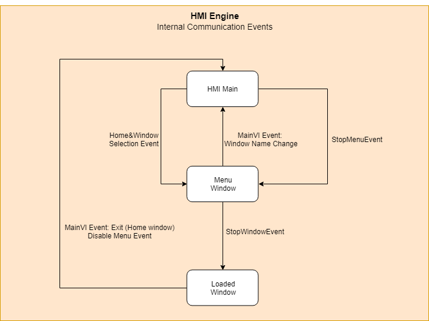

## User Interface  #TODO: to be updated

This is the brain of the app and manages way it works and transitions from one
window to another.

In this section all the windows of the HMI are explained.

### HMI Main EUI

#### Front panel

Explain the layout of the main.

#### Block Diagram

Explain the layout of the diagram.

##### Init & Exit Actions

Main VIs from the init actions and the initialized stuff.

##### Loops

Explain main loops and the task performed.

##### Event structure events

Explain the actions executed for each event.

### HMI Main HHD

#### Front panel

Explain the layout of the main.

#### Block Diagram

Explain the layout of the diagram.

##### Init & Exit Actions

Main VIs from the init actions and the initialized stuff.

##### Loops

Explain main loops and the task performed.

##### Event structure events

Explain the actions executed for each event.

### Navigation within the application

Explain: task actions, how new windows are loaded, and which events are
involved. The brain of this is the menu window.

Explain how it is made. Explain mandatory inputs/outputs and events a window
must have to work properly with the window loading.

What happens when the window is missing…

### Windows explained

Here all the different windows are explained one by one, explaining the main
code used to do so.

#### Window Menu Structure (tree)

A graph with all the different windows displayed in a tree.
