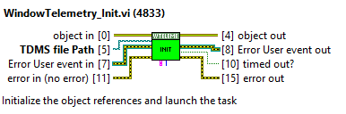
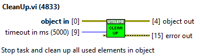
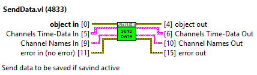
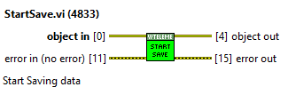
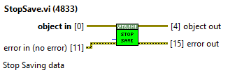

## Generic Window #TODO: to be updated

Explain the most generic window to avoid repeating in the following points.

### CMDs

List the CMDs available for this window. This generic window has no CMDs, but
each of them will have a list.

Explain how CMDs are sent to the PXI using the CppAppCommand.lvclass and its
childs.

### Front panel

Explain the layout of the windows, the generic one, the specific ones will be
explained in each chapter.

#### Monitoring

Explain indicators and controls of this area.

##### Shortcuts if existing

Tell how to identify if there are or not and explain what happens if you click
on them.

#### Control

Explain indicators and controls of this area, mainly these are buttons and
numeric indicators, but there are exceptions.

#### Block Diagram

Explain mandatory inputs/outputs and events a window must have to work properly
with the window loading.

##### Init & Exit Actions

Explain generic init and exit actions, specific ones will be explained in each
window.

##### Loops

Explain the generic loops that most of the windows have, any additional loops
will be explained on each window.

##### Event structure events

Explain the generic events that all the windows must contain, specific events
will be explained in each individual case.

Explain sequences for each CMD.

##### Window Movement Telemetry

Some windows have the option to save data for each movement. The idea is to have
a small file with data saved that allows a faster tune of that subsystem.

There is one class to do this task, the name of the class is
WindowTelemetry.lvclass

There are some public methods to manage the task

- WindowTelemetry_Init. This will be called at beginig to start the object and
    launch the task. It needs the input of the path where to save data. Allows
    the input of user event reference for publishing errors. If the reference is
    not given a new one is created. The user reference output will have the
    reference used.  

    

- CleanUp. It will close task and clean up the object. The reference for the
    error user event will be deleted only if the user event is created by the
    object

    

- SendData. This VI will send data to be saved to the task. The task will only
    save the received data if saving is active, otherwise this data will be
    discarded.

    

- StartSave. Ask task to save data. If the saving does not starts the VI will
    through an error  

    

- StopSave. Ask task to stop saving data. If the saving does not stops the VI
    will through an error  

    
