### Power Supply Window

This window manages the power supply of main axes.

#### CMDs

This window sends two commands:

##### Power

This command is used to power on/off the subsystem.

- Command name: CppAppMPSCMD.lvclass:ResetAlarm.CMD.

- Command number: 601

- Command Parameters string:

  - Boolean: Command to power on (1) or power off (0).

##### Reset Alarm

This command is used to reset subsystem.

- Command name: CppAppMPSCMD.lvclass:SendPower.CMD.

- Command number: 602

#### Front Panel

Following the generic window layout, the front panel is divided into two main
sections: monitoring and control sections. The monitoring area will show the
relevant information for the subsystem. Navigation across windows will be
sometimes possible by pressing the window section that shows the information of
a given subsystem. The control area will show the control actions available for
the subsystem.

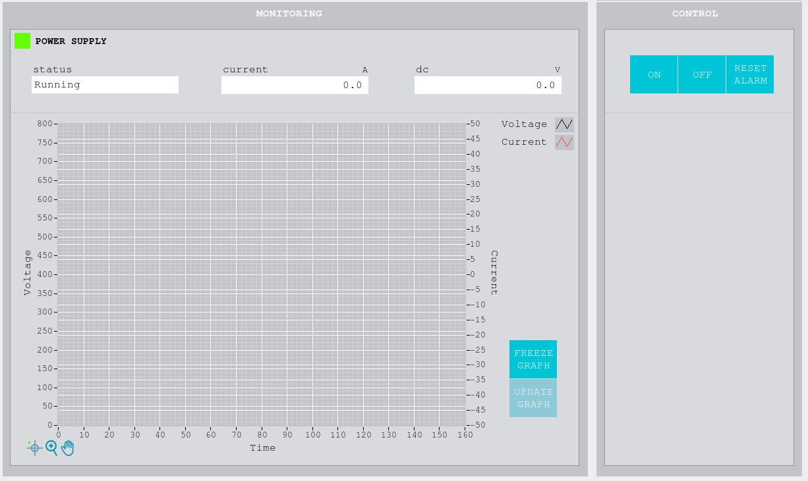

##### Monitoring

Within this part, all the indicators shown in Figure \ref{figureonehundredeighty-fived56fcea25c158a2e8dcc9d06ec6d4c8d} are described.

- The LED indicator is indicating the subsystem status.

  - Green: on.

  - Grey: off.

  - Red: fault.

- Status: this indicator does the same as the LED, monitoring the subsystem’s
    status by text.

- Current and DC voltage: those indicators, show the value of the current and
    the voltage.

- Graph. There are two buttons for stop updating values and for restart
    updating them:

  - Freeze graph: to stop the graph update.

  - Update graph: to continue the graph update.

##### Control

The control part is made up by three buttons:

- On button. Asks the subsystem to power on. When this button is pressed, the
    “On button” event is launched.

- Off button. Asks the subsystem to power off. When this button is pressed,
    the “Of button” event is launched.

- Reset button. Asks the subsystem to reset. When this button is pressed, the
    “Reset Alarm button” event is launched.

#### Connector pane

The required inputs for the VI are the following:

- Stop panel user event in: this is an input that has the reference to the
    event that stops the VI.

- VI Data: this input contains the following events’ references:

  - Sub Panel Window: reference to the subpanel where windows are loaded.
        Not used in this window.

  - Home and Window Selection User Event: event used to send the window
        selection to the menu from the loaded window. Not used in this window.

  - Main VI Events: event to communicate information to the main VI, the
        options available are: window name change, operation mode, alarm box and
        exit. Not used in this window.

  - Disable Menu? Event: event used to hide the menu when a CMD is active.
        used in SendDisableMenuEvent.vi at the InitSequence and EndSequence
        cases of the Consumer Loop.

  - HMIMain2Window Event: event to tell the actual window that the commander
        has changed from the main to the actual window. Used at the
        GetHMIMain2WindowEventRef.vi within LoopInitializationAction.vi.

#### Block Diagram

The block diagram is divided in three main areas: the init actions, the three
loops (the consumer loop, the main event loop and the updating graph loop) and
the exit actions.

##### Init Actions

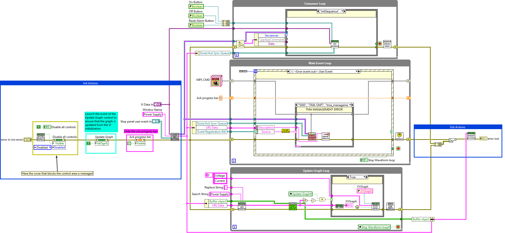

Within the initialization:

- ActivateDeactivateControls.vi: activates or deactivates front panel
    controls.

- Launch the event of the Update Graph control to ensure that the graph is
    updated from the VI initialization.

- Hide ack progress bar.

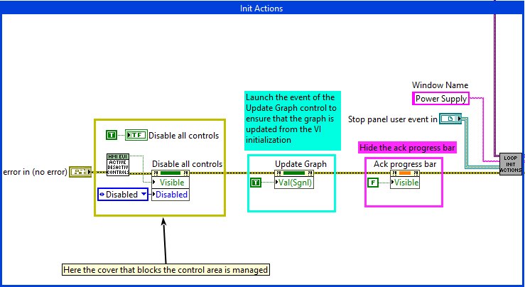

###### Loop Initialization Actions

This VI does the following, using InitGeneralHMIRefs.vi:

- Each of the possible user events are registered:

  - Some of them are obtained from the TMA using
        GetEVENTFromTMA.lvclass:GetEventRefs.vi (explained with more details in
        the list of subVIs). Ack/Done/Error/Warning event out are registered, so
        that they could be managed in the Main Event Loop, depending on the
        response received from the TMA.

  - The reference of the HMIMain2Window event, to use it to communicate the
        commander change from the Main VI to the deferent windows.

  - Stop panel user event, to stop the window manually.

  - An error event is created using CreateErrorEvent.vi, creating the error
        event used to send the event from the consumer loop to the main loop.

  - GetHMIMain2WindowEventRef.vi returns the reference of the HMIMain2Window
        event to use it to communicate information from the Main VI to the
        different windows.

- Also, a buffer is initialized and registered, to use it at the Update Graph
    Loop.

- URLs for telemetry are registered, as well.

- Done/Ack Sync Queue is registered, to use it to synchronize the ack and done
    events with the TMA.

- Publish the local STO to false, has this system has no specific STO.

- Following information is obtained from this VI:

  - Consumer Loop Queue

  - Initialized References (Buffer object, Done/Ack Sync Queue, URL data and
        Event Registration Ref)

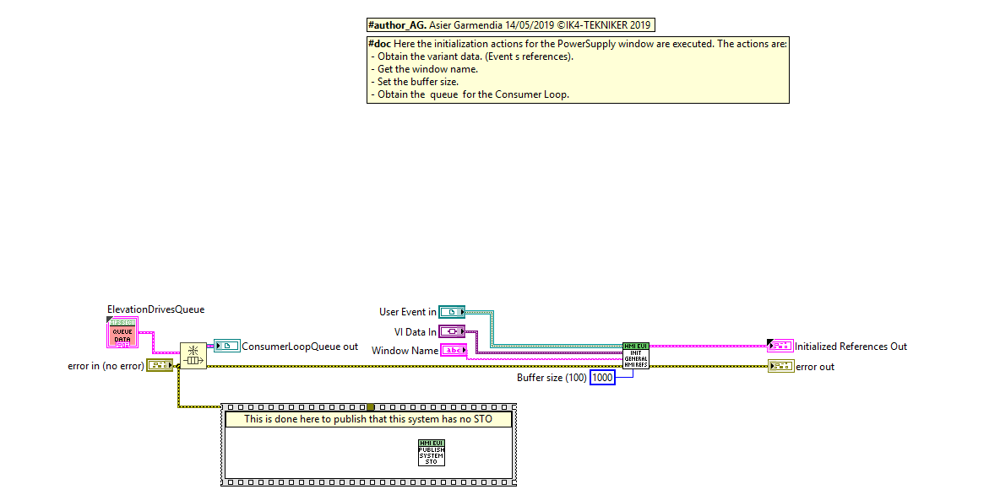

##### Exit Actions

At the exit part, the errors from different loops are appended. In the
HMIExitActions VI following actions are executed:

- The Destroy Error Event VI destroys the error event used to send the error
    from the consumer loop to the main loop.

- Deregister the telemetry data for the HHD.

- Clean up the graph buffer.

- Deregister event references.

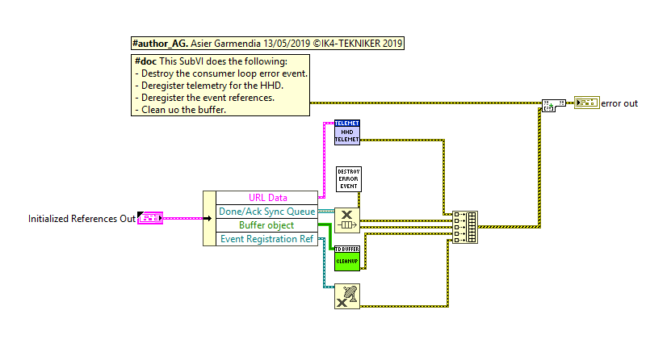

##### Loops

There are three loops, the Main Event loop, the consumer loop and the update
graph loop. The communication between them is reviewed in the following figure:

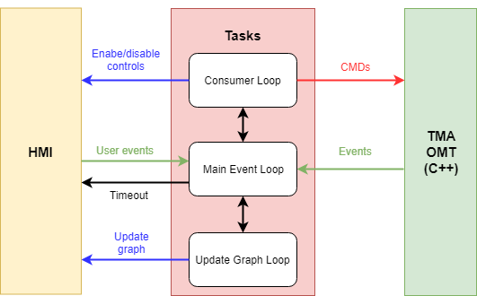

###### Main event loop

This loop responds to the events received from: the user actions in this window,
the error event from secondary loops, the events from Main.vi and Menu.vi and
the events from the PXI.

All the events are described in the next section.

####### Freeze Graph

Stop the graph update.

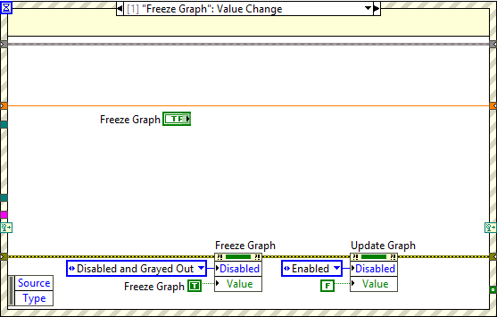

####### Update graph

Start the graph update.

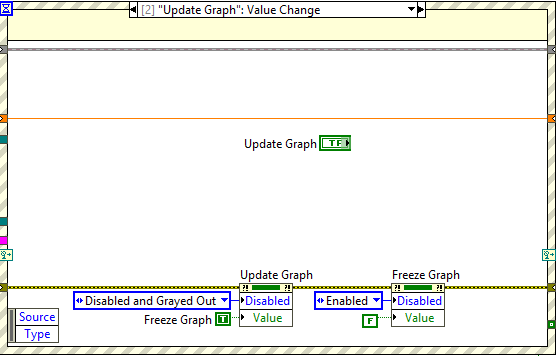

####### Stop panel

This event stops the VI. StopVISequenceEnqueue VI enqueues all the steps needed
to stop the window.

The sequence steps are:

- EndSequence.

- Stop VI.

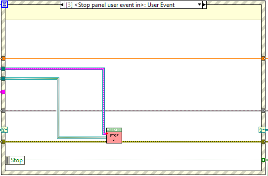

####### Timeout event

Updates the data for the monitoring area unless the graph.

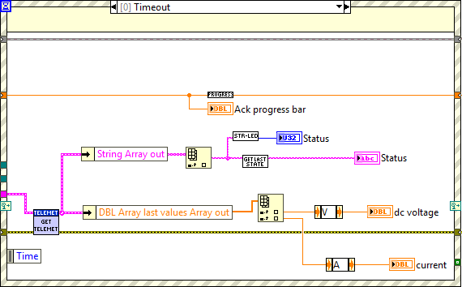

####### Ack event out

This is executed when an ack event is received from the PXI. The next sequence
step, Wait For Done, is enqueued to the Consumer Loop queue at the opposite end,
and True constant is enqueued to the Done/Ack Sync queue to exit the wait for
ack state of the consumer loop.

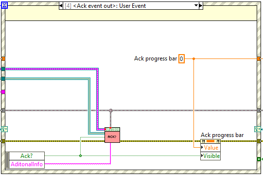

####### Done event out

This is executed when a done event is received from the PXI. A true constant is
enqueued at the synchronization queue to exit the wait done case at the consumer
loop.

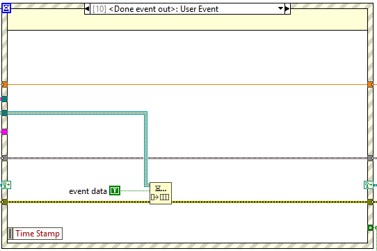

####### Consumer loop error event out

It puts an error coming from other loops to the error line.

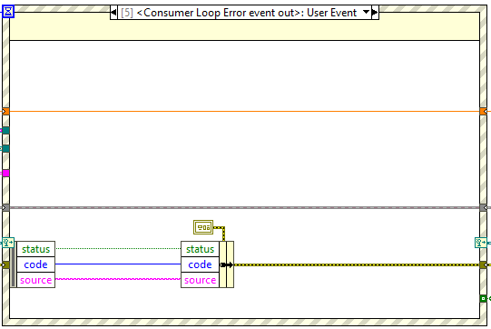

####### Error event out

This is executed when an error event is received. It does the following:

- Filter the source to get the command family number:

  - 600 belongs to PowerSupply. In this case,
    - MPSSequences.lvlib:ForceTerminateSequence.vi is executed.

  - 5000 belongs to TMA OMT. In this case:

    - MPSSequences.lvlib:ForceTerminateSequence.vi is executed.

    - A pop-up is launched to display the error.

  - If the error has another origin do nothing.

The VI ForceTerminateSequence does the following:

- Flush queue.

- Enqueue EndSequence.

- Enqueue a true at the Synchronization queue.

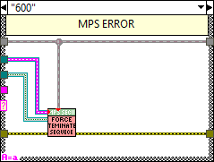

####### On button

It enqueues the steps needed to turn on the subsystem using the
OnSequenceEnqueue.

The following sequence steps are enqueued:

- InitSequence.

- On

- WaitForAck.

- EndSequence.

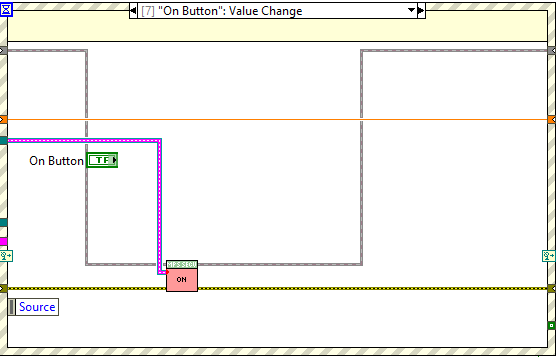

####### Off button

It enqueues the steps needed to turn on the subsystem using the
OffSequenceEnqueue.vi.

The following sequence steps are enqueued:

- InitSequence.

- Off

- WaitForAck.

- EndSequence.

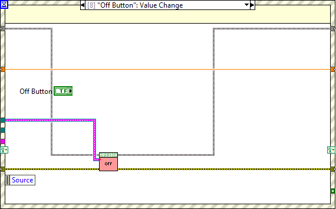

####### Reset alarm button

It enqueues the steps needed to reset the subsystem using the
ResetSequenceEnqueue.vi.

The following sequence steps are enqueued:

- InitSequence.

- Reset

- WaitForAck.

- EndSequence.

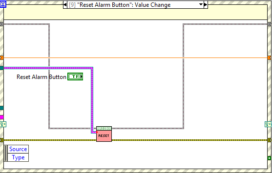

####### HMIMain2Window Event out

It receives the event reference coming from the main, and depending on it does
the following:

- Update Commander: it updates the visibility and the enabling of the controls
    depending on the mode of operation and the device used.

- Default: it does nothing.

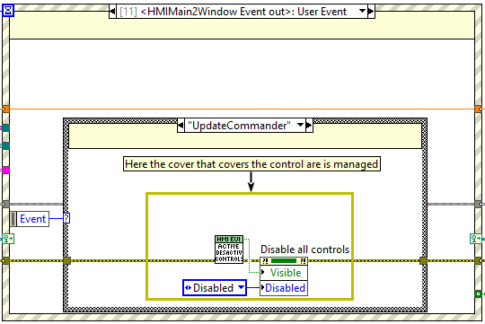

###### Consumer Loop

Here the steps enqueued by the main loop are dequeued and processed.

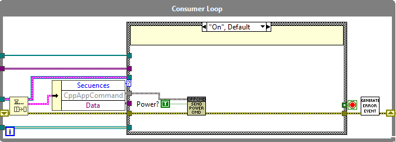

In this loop CppAppMPSCMD.lvclass, that is inherited from CppAppCommand.lvclass,
is received from the main loop. It overrides the methods of
CppAppCommand.lvclass. This class has only 2 methods as this subsystem has only
two CMDs available.

Available methods:

- Power CMD: CppAppMPSCMD.lvclass:SendPowerCMD.vi

- Reset Alarm CMD: CppAppMPSCMD.lvclass:ResetAlarm.vi

####### On

Requests to turn on the subsystem using the SendPowerCMD.vi, overridden by the
one from the CppAppMPSCMD.lvclass.

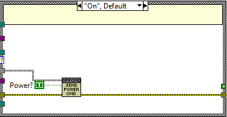

####### Off

Requests to turn off the subsystem using the SendPowerCMD.vi, overridden by the
one from the CppAppMPSCMD.lvclass.

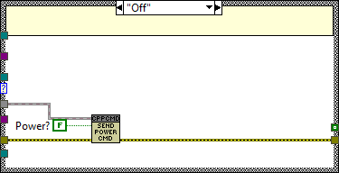

####### Reset

Requests to reset alarms of the subsystem using the ResetAlarm.vi, overridden by
the one from the CppAppMPSCMD.lvclass.

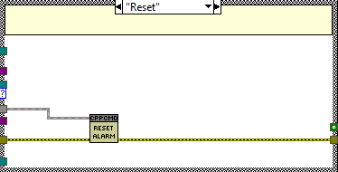

####### Wait For Ack

It waits for the ack response of the PXI in order to synchronize. After a
timeout of 2,5 seconds throws a timeout error, the ack must be received before
this timeout.

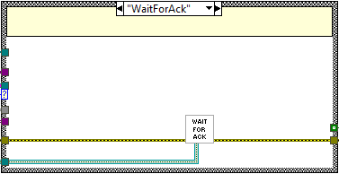

####### Wait For Done

It waits for the done response of the PXI in order to synchronize. After the
specified timeout at the ack event a timeout error is throwed.

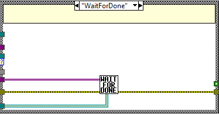

####### Init Sequence

This case puts the window in executing mode: disabling the possibility of
pushing buttons and hiding the menu.

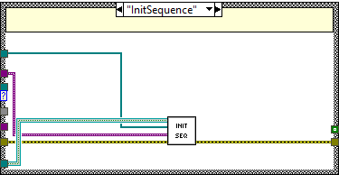

####### End Sequence

This case puts the window back into normal mode: hides the ack progress bar,
enables the controls and shows the menu.

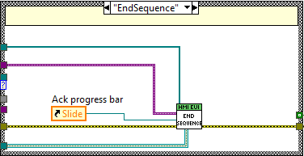

####### Stop VI

This case is used to stop the current loop. Here the Consumer Loop queue is
released.

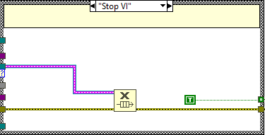

###### Update Graph Loop

This loop at the bottom is used uniquely for the graph management.

UpdateHMIWaveformFromDBLArrayVariables.vi takes from the telemetry task the
values to plot in the graph. The graph is updated with the
UpdategraphPlotNames.vi. The temporization of the loop is done by the
TelemetryLoggingTask.lvclass:GetNewTelemetryData.vi that waits until new data is
available.

The case structure from the loop has two possible cases:

- If the waveform array is not empty and the local variable update graph is
    true:

  - The graph time is change to relative time ToRelativeTime.vi.

  - The graph is updated.

  - Legend names are updated if first call.

- In other cases, nothing is done.

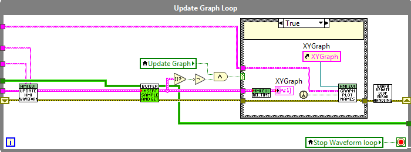

#### List of SubVIs

- Activatedeactivatecontrols.vi: This manages the control cover, to do so it
    checks the following global variables:

  - GBL_UserGroups

  - GBL_OperationMode

  - GBL_CurrentDevice

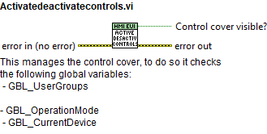

- Buffer.lvclass:InsertSampleAndGetBuffer.vi: Insert sample in the buffer and
    get last desired elements of the buffer

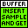

- CppAppCommand.lvclass:ResetAlarm.vi: Send Reset Alarm Command to

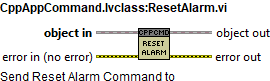

- CppAppCommand.lvclass:SendPowerCMD.vi: Send Command to TMA Management

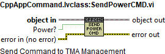

- EndSequence.vi: It disables the possibility of pushing buttons sending the
    event disable menu. Buttons are greyed out and the ack progress bar is made
    invisible.

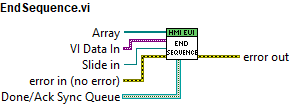

- FilterSource.vi: The source will be filtered to get the command family
    number if it exist. If the number does not exist the source will be
    transmitted as it comes.

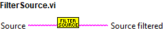

- GenerateErrorEvent.vi: Generates the error event when an error occurs at the
    consumer loop of the HMI windows

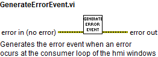

- GetLastStateChartState.vi: This vi takes the last state from the status
    string.

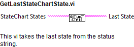

- GetTelemetryForWindow.vi: Get telemetry data for the specified window.

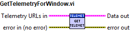

- GraphUpdateLoopErrorHandling.vi: Graph update while loop error handling,
    this VI is makes the required actions to manage the errors in the graph
    update loop.

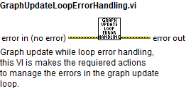

- HMIExitActions.vi: This SubVI does the following:

  - Destroy the consumer loop error event.

  - Deregister telemetry for the HHD.

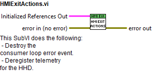

- HMITimeoutChoice.vi: Define the timeout for refreshing the HMI depending on
    the current device GBL

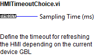

- InitSequence.vi: It disables the possibility of pushing buttons sending the
    event disable menu. Buttons are greyed out.

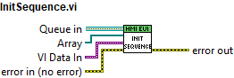

- LoopInitializationActions.vi: Here the initialization actions for the
    PowerSupply window are executed. The actions are:

  - Get the telemetrry URLs for this window.

  - Obtain the queue for consumer loop.

  - Obtain the queue for the main loop.

  - Register events for the window

  - Ack Event: This one is taken from the
        GetEVENTFromTMA.lvclass:GetEventRefs. - Done Event: This one is taken
        from the GetEVENTFromTMA.lvclass:GetEventRefs. - Error Event: This one
        is taken from the GetEVENTFromTMA.lvclass:GetEventRefs. - Warning Event:
        This one is taken from the GetEVENTFromTMA.lvclass:GetEventRefs.

  - Consumer Loop Error Event: This one is created here and then registered.

  - HMIMain2Window Event: This one is taken from the VI Data In.

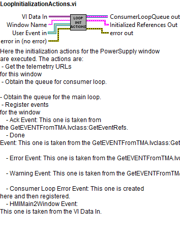

- MPSSecuences.lvlib:ForceTerminateSequence.vi: Forces to end the sequence.
    Error in the input is only transmitted to the output.

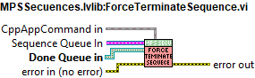

- MPSSecuences.lvlib:NoAckOperations.vi: Do the operations for an ack event:

  - Ack: Do nothing.

  - No Ack: Restore window and show a pop-up.

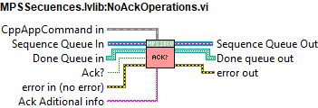

- MPSSecuences.lvlib:OffSecuenceEnqueue.vi: Enqueues the sequences needed to
    turn off the system..

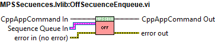

- MPSSecuences.lvlib:OnSecuenceEnqueue.vi: Enqueues the sequences needed to
    turn on the system..

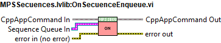

- MPSSecuences.lvlib:ResetSecuenceEnqueue.vi: : Enqueues the sequences needed
    to reset the system.

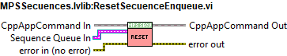

- MPSSecuences.lvlib:StopVISecuenceEnqueue.vi: : Enqueues the sequences needed
    to stop the VI.

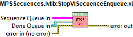

- PanelErrorHandling.vi: Display the error using a "Simple error handler" if
    the error is new.

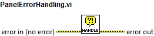

- ProgressVarUpdate.vi: This VI makes the progress var keep restarting it self
    for ever.

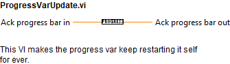

- StringStatus2ColorBoxStatus.vi: Gets the color for the status indicator from
    the status string. The status and arrive with substates (case insetive) This
    will put a green color in the output if the status starts with a "On" word
    This will put a red color if "Fault" or "alarm" is the status string or if
    starts with "internal errors" Warning is not implemented yet

- TimeDataBuffer.lvclass:InsertSampleAndGetBufferTimeData.vi: Insert sample in
    the buffer and get last desired elements of the buffer

- TMAOMT_ErrorDialog.vi: Shows a pop up window when an error occurs at the TMA
    Management Operation task

- ToRelativeTime.vi: Converts full time to relative.

- UpdateGraphPlotNames.vi: Update legend names using the variable names. The
    legend row number is changed according to the number of waveforms

- UpdateHMIWaveformFromDBLArrayVariables.vi: Generates the waveform to display
    by the HMI

- WaitForAck.vi: Sets timeout with a fixed time of 2500 ms as it should
    respond very fast.

- WaitForDone.vi: Add 2500ms to received timeout. The TMA OMT will add 2000 ms
    to the received timeout so this 500 ms more.

