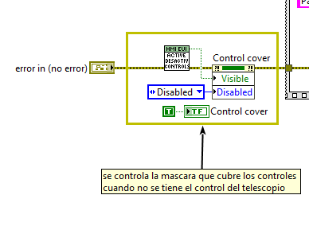

# Develop tools and developing tips #TODO: to be updated

Each of us must explain the develop tools and tips related to our tasks.

## Develop tools

Here explain which tools have been developed to help the develop process of an
specific task/window/event.

## Developing Tips

Here explain the tips for developing, like how to create a new window, a new
event a new task and things like that…

### New window creation

Here the process to create a new window is explained.
How is easier to copy an
existing window and modify it to work as wanted.

When adding a new window to the HMI, follow these steps:

1. Create the new screen or copy it from an existing one (with a similar appearance) to maintain the format.

2. Once the screen is created, give it a name appropriate to its content; it must end with "_EUI.vi." Important points that the new window must have:

    a. The pane connector must be the same as the one in the following screenshot.

    

    b. Place the VI: **Activate/DeactivateControls.vi**, in the VI initialization to activate or deactivate the control buttons by covering them with a translucent gray button. This way, when the device doesn't have the control, the controls are disabled.

    

    c. Once the necessary initialization for the VI has been performed, when registering the events to which the event system will respond, the **ACK**, **DONE**, **STOP** (make the window stop when requested), **ERROR**, and **WARNIG** events must be added. To do this, use the VI: **GetEventRefs.vi**.

    

    d. Once this is done, the initialization is complete, and all that remains is to place the **while** loop with the event system and the events necessary for the window to function. It is possible to require more than one **while** loop to perform sequences or data acquisition; the best option is to find a screen that has one integrated and see how it is done to obtain a similar solution.

    e. Finally, the window cleanup is complete, where the created references will be closed and where we will ensure that the tabs and scroll bars are left in the correct position for the next execution. It is important to place the following VI at the end of the window's error line, called: **WriteExitHMIError.vi**, which is important to report any errors while closing the window.

    

3. Once the window's VI is complete, modify the VI: **Menu_EUI.vi**.

    a. Within the menu, the first thing to do is add a button at the level corresponding to the newly created window. When doing this, it is recommended to use a large screen in a vertical position, as the menu is very long and can be viewed correctly without having to activate the scroll bars. Doing so will make it very difficult to realign the menu properly.

    b. Align the button with the rest of the existing menu elements (same top spacing, font size, and Boolean text alignment with the column).

    c. The button's label must have the same name as the window, without the "_EUI.vi" element.

    d. The created button must be added to the event for opening the windows. This event contains the rest of the buttons responsible for opening each window (these are the ones without an arrow).

    e. Once this is done, the window will load when the button is clicked. (However, it will not maintain the main configuration upon loading; the name and path will not appear, and neither the alarm zone nor the safety zone will be displayed.)

    f. To do this, modify the Main VI (**MainEUI.vi** and **MainHHD.vi**) in the "Main VI Events > Window Name Change" event and within this, in the "case" by adding a new case, or by including it within one of the cases containing the VIs at the same level as the new window.

    g. If this window is called from a window shortcut, a transparent and gray button must be added to said window and given the same label as the menu button in point b.

    h. The menu VI must also be modified so that it responds properly to this action. To do this, follow these steps:

        i. Open the "Home and Window Selection User Event out" event.
 
        ii. Within this event, modify the case to contain the desired window and move the menu to display the button referenced by the shortcut.
 
        iii. In the case, specify whether there is one or more pages at that level, which is the header button for that level, the button pressed, and the corresponding column number.
 
        iv. This adds a window that does not require a new level.

4. If the new window has a new level, a new header will be required to include it, as well as a new column. To do this:

    a. Create a new header button, one with a left arrow, and place it at the top.

    b. Give it a clear name, such as the subsystem to which the level belongs, for example.

    c. This button must be added to the event intended to go back in levels.

    d. Within this, the case must be modified so that when pressed, the menu scrolls, the first window of the new level is loaded, the up and down arrows are disabled/enabled, and the number of pages in the new level is specified.

    e. Once this is done, you can exit the level.

    f. To access it, you must add a subsystem button, a button with a right arrow, which will scroll the menu to the newly created level.

    g. This is added to the desired level and given the name of the subsystem to which it will scroll, plus "menu".

    h. Once the button is ready and aligned in its place, it is registered in the event containing the other buttons of this type.

    i. Within this, the case must be modified so that, as in the other cases, it scrolls to the corresponding column and loads the first screen of that level, as well as enabling or disabling the up and down arrows.
